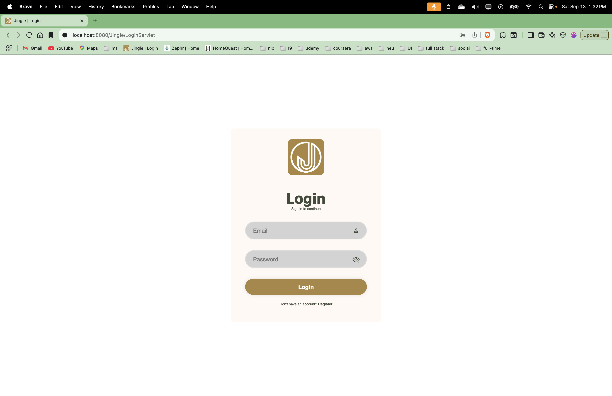
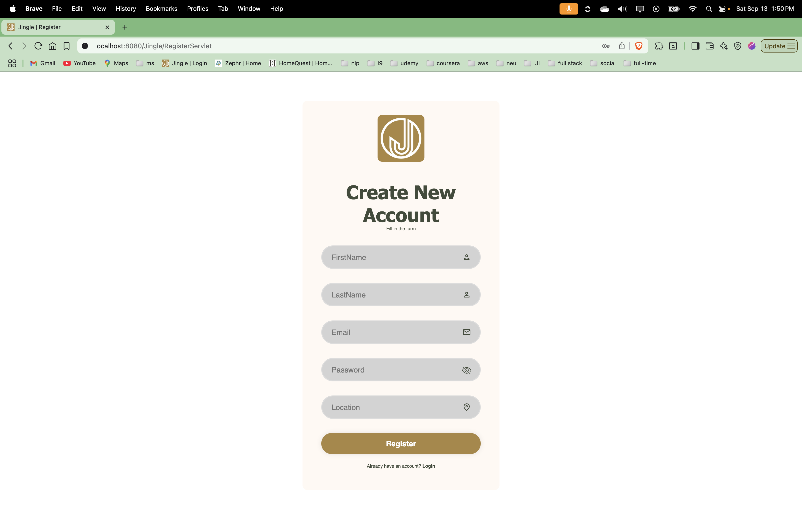
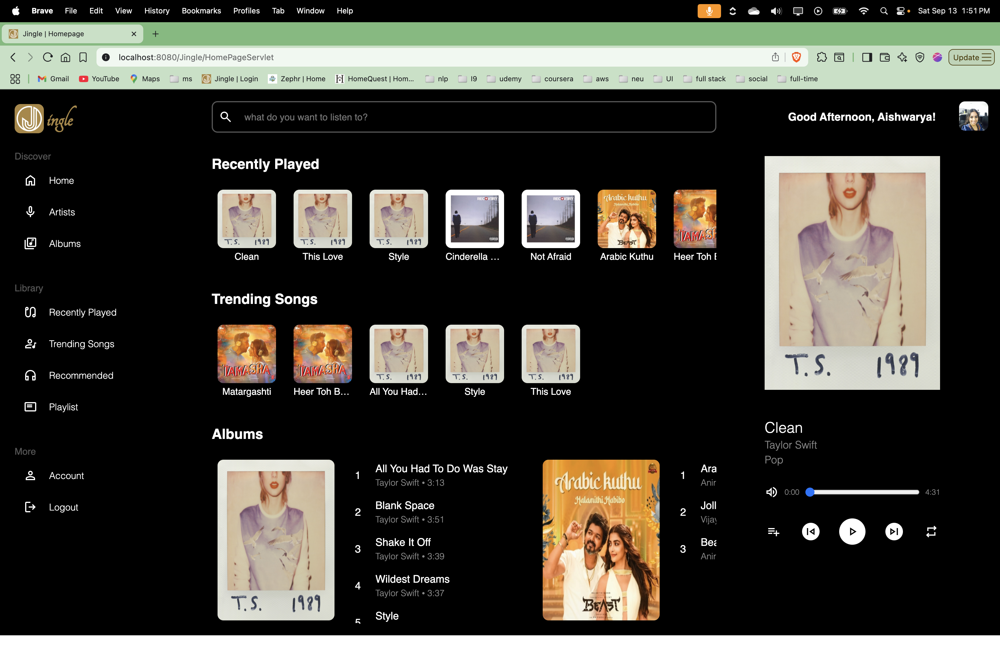
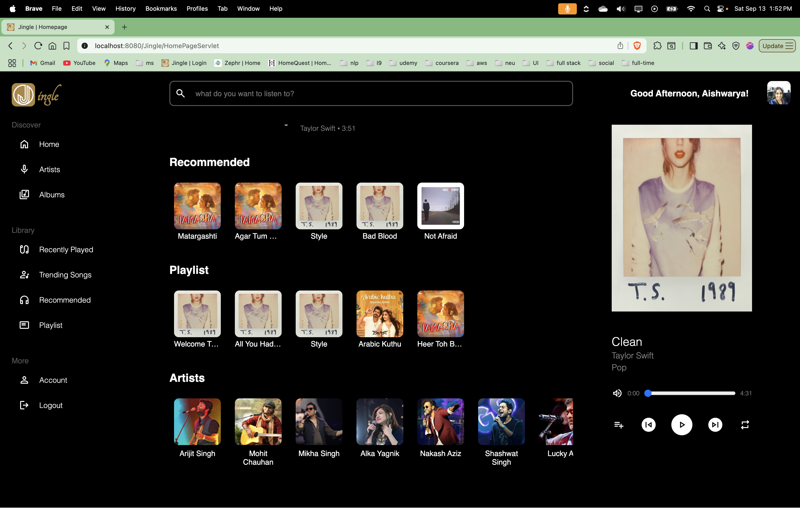

# Jingle 🎵

A full-stack music streaming web application built using Java technologies with an intelligent recommendation system.

## 📋 Table of Contents
- [Overview](#overview)
- [Architecture](#architecture)
- [Features](#features)
- [Recommendation System](#recommendation-system)
- [Technologies Used](#technologies-used)
- [Usage](#usage)
- [Contributing](#contributing)
- [Screenshots](#screenshots)

## 🎯 Overview

Jingle is a comprehensive music streaming application that provides users with a personalized music experience. Built with a robust MVC architecture, it features user authentication, playlist management, and an intelligent recommendation system powered by collaborative filtering algorithms.

## 🏗️ Architecture

### MVC Pattern Implementation

The application follows the **Model-View-Controller (MVC)** architectural pattern:

#### **Frontend (View)**
- **JSP (Java Server Pages)**: Dynamic content rendering
- **HTML**: Web structure and layout
- **CSS**: Styling and responsive design
- **JavaScript**: User interaction handling and dynamic behavior

#### **Controller**
- **Java Servlets**: Application flow control and request handling
- **Functionality**:
  - Route management between JSP pages
  - Backend communication via helper classes
  - Data flow orchestration between frontend and backend

#### **Backend (Model)**
- **Database**: MySQL Workbench (SQL)
- **Data Structure**: Relational tables with foreign key relationships
- **Model Classes**: Data representation and database interaction
- **Server**: Apache Tomcat deployment container

### Architecture Flow
1. User interactions captured by JavaScript in the frontend
2. Servlets control application flow and call appropriate JSP pages
3. Backend interaction through helper classes
4. Data storage and retrieval via SQL queries in MySQL Workbench

## ✨ Features

### 🔐 User Authentication & Personalization
- **Secure Login/Logout**: Credential validation against database
- **Account Registration**: Unique email-based registration with duplicate detection
- **Profile Management**: Profile picture display with default fallback
- **Dynamic Greeting**: Time-based personalized greetings
  - Morning: "Good morning, [User]!"
  - Afternoon: "Good afternoon, [User]!"
  - Evening: "Good evening, [User]!"
  - Night: "Good night, [User]!"

### 🎛️ User Interface
- **Navigation Menu**: Seamless app navigation without manual scrolling
- **Account Section**: User information display and management
- **Search Functionality**: Keyword-based music search with instant results

### 🎵 Music Features
- **Recently Played**: Display of 10 most recent tracks
- **Trending Songs**: Top 5 most played songs across the platform
- **Albums**: Comprehensive album catalog with associated songs
- **Playlists**: Personal playlist management
- **Artists**: Curated artist directory

### 🎮 Playback Controls
- **Dynamic Song Card**: Real-time display of currently playing track
- **Playback Controls**:
  - Play/Pause toggle
  - Next/Previous track navigation
  - Loop/Unloop functionality
  - Add/Remove from playlist
  - Mute/Unmute audio
- **Progress Tracking**: Visual progress bar with time indicators

## 🤖 Recommendation System

### Implementation Approach
The application employs a sophisticated recommendation system combining multiple techniques:

#### **Popularity-Based Recommendations**
- Songs ranked by total listen count across all users
- SQL query-driven approach for top 5 trending tracks
- No separate ML model required

#### **Collaborative Filtering** ⭐
**Primary recommendation engine** using user behavior analysis:

##### **Data Preparation**
- Matrix construction with userId, songId, and play count
- User-song interaction matrix formation

##### **Algorithm Implementation**
- **Matrix Factorization**: Decomposition into M1 × M2 matrices
- **Alternating Least Squares**: 10-iteration optimization process
- **Prediction**: Empty matrix cell value prediction for recommendations

##### **Technical Stack**
- **Flask**: Web framework for recommendation API
- **Python**: Core algorithm implementation
- **Integration**: Seamless connection with Java backend

### Recommendation Logic
```
Users/Songs | S1 | S2 | S3
------------|----|----|----
U1          | ?  | 2  | 6
U2          | 3  | 2  | ?
U3          | ?  | ?  | 5
```

The system identifies users with similar listening patterns and suggests songs based on collaborative preferences.

## 🛠️ Technologies Used

### Backend
- **Java**: Core application logic
- **Java Servlets**: Request handling and routing
- **JSP**: Server-side rendering
- **MySQL**: Database management
- **Apache Tomcat**: Application server

### Frontend
- **HTML5**: Structure and semantics
- **CSS3**: Styling and responsive design
- **JavaScript**: Dynamic interactions and DOM manipulation

### Recommendation Engine
- **Python**: Algorithm implementation
- **Flask**: Recommendation API
- **NumPy/Pandas**: Data processing (implied)

## 📱 Usage

1. **Register/Login**: Create an account or log in with existing credentials
2. **Explore Music**: Browse albums, artists, and trending songs
3. **Create Playlists**: Add favorite songs to personal playlists
4. **Discover Music**: Get personalized recommendations based on listening history
5. **Enjoy Playback**: Use the full-featured music player controls

## 🤝 Contributing

Contributions are welcome! Please feel free to submit a Pull Request.

### Future Enhancements
- User profile update functionality
- Enhanced content-based filtering
- Mobile app development
- Social sharing features

## 📸 Screenshots

### Authentication Flow
| Login Page | Registration |
|------------|-------------|
|  |  |

### Main Application Interface
| Dashboard | Music Player |
|-----------|--------------|
|  |  |

### Key Features Showcase
- **Recently Played**: Shows the 10 most recent tracks with album artwork
- **Trending Songs**: Displays top 5 popular tracks across all users  
- **Albums Section**: Complete album catalog with track listings
- **Recommended**: Personalized suggestions powered by collaborative filtering
- **Playlist Management**: User-created playlists with add/remove functionality
- **Artists Gallery**: Browse music by artist with rich visual cards
- **Music Player**: Full-featured player with progress bar, controls, and song info

---

**Developed with ❤️ by Aishwarya Ravichandran**

*Last Updated: December 12, 2023*
